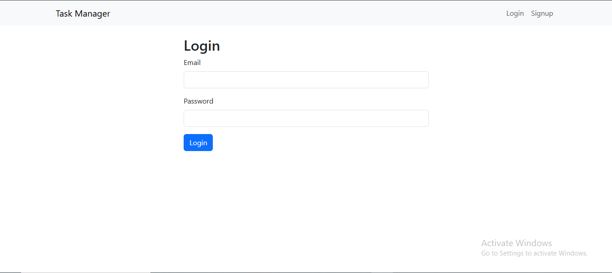
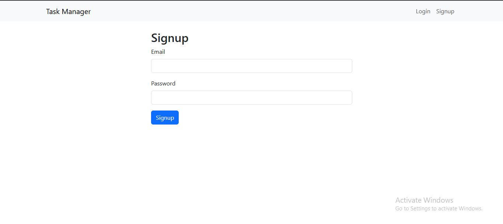
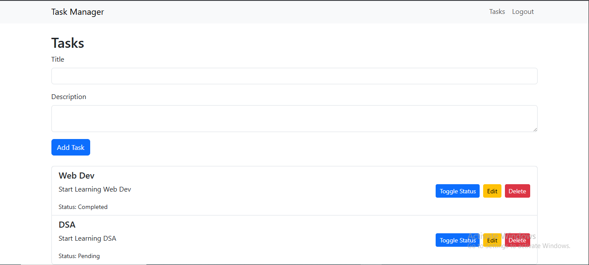

<h1>Task Manager App</h1>

A full-stack MERN (MongoDB, Express.js, React, Node.js) application for managing tasks with user authentication and task CRUD operations.

<strong>Repository:</strong> <a href="https://github.com/your-username/task-manager">GitHub</a>

<h2>Features</h2>
    <ul>
      <li>User authentication (signup/login) using JWT.</li>
      <li>Create, read, update, and delete (CRUD) tasks.</li>
      <li>Toggle task status (Pending ↔ Completed).</li>
      <li>State management with Redux Toolkit.</li>
      <li>Responsive UI with Bootstrap.</li>
      <li>Data persistence in MongoDB (local or Atlas).</li>
    </ul>
  

<h2>Tech Stack</h2>
    <ul>
      <li><strong>Frontend:</strong> React, Redux Toolkit, React Router, Axios, Bootstrap</li>
      <li><strong>Backend:</strong> Node.js, Express.js, Mongoose, JWT, bcryptjs</li>
      <li><strong>Database:</strong> MongoDB (local or MongoDB Atlas)</li>
      <li><strong>Tools:</strong> Git, npm, nodemon</li>
    </ul>

<h2>Prerequisites</h2>
    <ul>
      <li>Node.js (v16 or later): <a href="https://nodejs.org/">Download</a></li>
      <li>MongoDB (local or Atlas): <a href="https://www.mongodb.com/try/download/community">Local</a> or <a href="https://www.mongodb.com/cloud/atlas">Atlas</a></li>
      <li>Git: <a href="https://git-scm.com/">Download</a></li>
      <li>GitHub account: <a href="https://github.com/">Sign up</a></li>
    </ul>
  

  

    <h2>Installation</h2>
    <h3>1. Clone the Repository</h3>
    <pre><code>git clone https://github.com/your-username/task-manager.git
cd task-manager</code></pre>

  <h3>2. Set Up Backend</h3>
    <pre><code>cd server
npm install</code></pre>
    
Create a <code>.env</code> file in <code>server/</code>:

    <pre><code>PORT=5000
MONGO_URI=mongodb://localhost:27017/task-manager
JWT_SECRET=your_jwt_secret_key</code></pre>
    
For MongoDB Atlas, replace <code>MONGO_URI</code> with your Atlas connection string.

  <h3>3. Set Up Frontend</h3>
    <pre><code>cd ../client
npm install</code></pre>
    
Create a <code>.env</code> file in <code>client/</code>:

    <pre><code>REACT_APP_API_URL=http://localhost:5000/api</code></pre>

  <h3>4. Run MongoDB (Local)</h3>
    <pre><code>mkdir -p ~/data/db
mongod --dbpath ~/data/db</code></pre>

  <h3>5. Run the Application</h3>
    
Backend:

    <pre><code>cd server
npm run dev</code></pre>
    
Frontend:

    <pre><code>cd ../client
npm start</code></pre>
    
Open <a href="http://localhost:3000">http://localhost:3000</a> in your browser.

  

<h2>Usage</h2>
    <ul>
      <li><strong>Signup:</strong> Go to <code>/signup</code> to create a user.</li>
      <li><strong>Login:</strong> Go to <code>/login</code> to access the task list.</li>
      <li><strong>Tasks:</strong> Create, edit, delete, or toggle task status (Pending ↔ Completed).</li>
      <li><strong>Verify Data:</strong> Use MongoDB shell or Compass to check <code>users</code> and <code>tasks</code> collections.</li>
    </ul>

<h2 id="screenshots">Screenshots</h2>
    <ul>
        <li><strong>Login Page</strong>: </li>
        <li><strong>Signup Dashboard</strong>: </li>
        <li><strong>Dashboard</strong>: </li>
    </ul>

<h2>Project Structure</h2>
    <pre><code>task-manager/
├── client/               # React frontend
│   ├── src/             # React components, Redux store
│   ├── public/          # Static assets
│   ├── .env             # Frontend environment variables
│   └── package.json
├── server/               # Node.js/Express backend
│   ├── config/          # MongoDB connection
│   ├── middleware/      # Authentication middleware
│   ├── models/          # Mongoose schemas
│   ├── routes/          # API routes
│   ├── .env             # Backend environment variables
│   ├── server.js        # Express server
│   └── package.json
├── .gitattributes       # Line ending normalization
├── .gitignore           # Ignored files
└── README.html          # This file
</code></pre>

<h2>Contributing</h2>
    
Contributions are welcome! Please fork the repository and submit a pull request.

